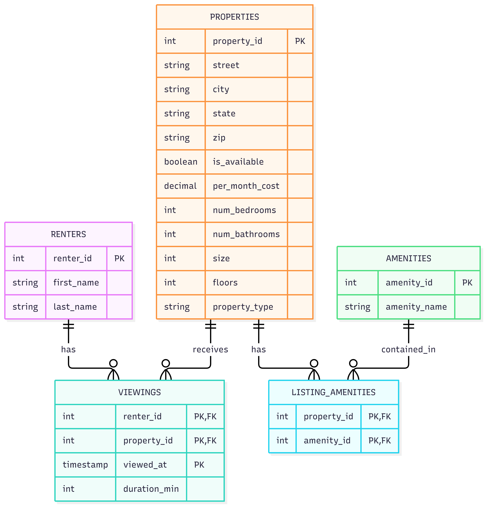

# ex603-rentalmarketplace-database
BU 603 Project
My name is Intisar Ratul and the theme I chose for the project is Rental Marketplace. The system allows renters to view properties classified by amenities through listing_amenities, and each viewing is logged with its duration_min to analyze engagement.
This project models a rental marketplace platform where renters browse and view property listings before deciding to rent. The core relationship the platform must support is the interaction between renters and properties: which renters viewed which properties, when, and for how long.The platform must answer questions such as: which properties are most frequently viewed, how long renters typically spend viewing a listing, which amenities are most common across available properties, and which properties are currently available for rent. Properties are described by attributes such as monthly cost, number of bedrooms and bathrooms, size, floor count, and property type, allowing renters to filter listings that match their needs.Amenities (e.g., pool, gym, parking, pet-friendly) are modeled as a separate catalog rather than as columns on the property table, since a property can have any number of amenities and an amenity can apply to any number of properties — a many-to-many relationship resolved through a junction table.
Schema

The database has five tables, created in this order:

renters (actor): people who view properties. Key: renter_id.
properties (producer): rental listings with address parts, cost, bedrooms, bathrooms, size, floors, type, and an availability flag. Key: property_id.
amenities (catalog): named features such as Pool or Gym. Key: amenity_id.
viewings (event): one row per renter viewing a property, with viewed_at and duration_min. Composite key: (renter_id, property_id, viewed_at).
listing_amenities (junction): links properties to amenities (many-to-many). Composite key: (property_id, amenity_id).

Design decisions to notice:

Deleting a renter is blocked while they have viewings (RESTRICT), so the duration data behind aggregate statistics is never lost. All other foreign keys use CASCADE.
Seven CHECK constraints keep invalid values out: no negative counts or prices, a fixed set of property types, and durations above zero.
Money is NUMERIC(10,2), never floating point.
Names and addresses are split into parts so they can be filtered and sorted; the full name is computed at query time.
schema.sql can be re-run at any time because it drops the tables first, in reverse creation order.

